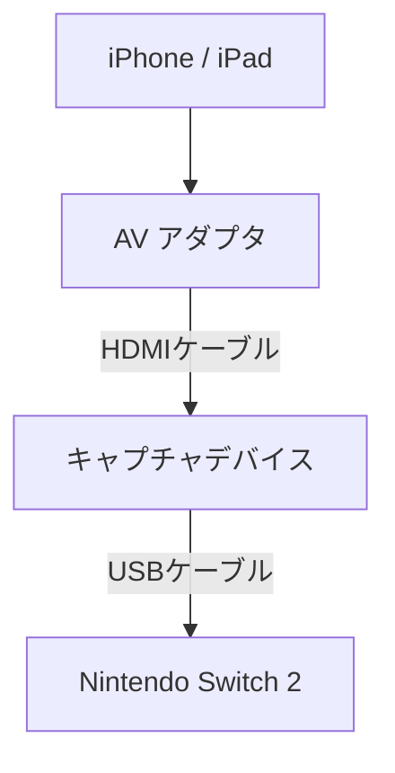

# Nintendo Switch 2 のゲームチャット機能でアバターを利用しよう！

※この記事は Nintendo Switch 2 発売前に書かれているモノであり、実働確認は行われていません。

## ハードウェア構成

## iPhone / iPad

カメラなどを用いてユーザーの表情や身動きをトラッキングしてアバターモデルを動かすソフトを動作させる環境。 iPhone / iPad ではなく、 Android や PC でも良いのですが、ここでは iPhone / iPad を前提とします。

## AV アダプタ

iPhone / iPad のコネクタが Lightning か USB type-C かで適切な方を使います。

- [Lightning - Digital AVアダプタ](https://www.apple.com/jp/shop/product/MW2P3AM/A/lightning-digital-av%E3%82%A2%E3%83%80%E3%83%97%E3%82%BF)
- [USB-C Digital AV Multiportアダプタ](https://www.apple.com/jp/shop/product/MW5M3ZA/A/usb-c-digital-av-multiport%E3%82%A2%E3%83%80%E3%83%97%E3%82%BF)

( 必ずしも純正品である必要はないと思いますが、純正品の方が無難かと。 )

## キャプチャデバイス

以下のモノ以外にも色々あります。予算と求める品質等で選んでください。

- [AVerMedia Live Streamer CAP 4K](https://www.avermedia.co.jp/product-detail/BU113)

( ゲーム画面のキャプチャ用のモノを流用するのもありですが、この用途として使うには HDMI のパススルー出力などがオーバースペックとなるので、この用途の為だけに購入するには割高になってしまうかと。 )

## アバターモデル

アバターモデルには大きく 3D ベースのモデルと 2D ベースのモデルが存在します。現状、それが一般的だからと言う以外の理由はないですが、ここでは 3D ベースのモデルなら VRM を、 2D ベースのモデルなら Live2D を推奨します。

一般的に 3D ベースのモデルは様々な方向からの見た目に対応しており、 2D ベースのモデルは正面方向からの見た目に限定されますが、イラストベースである事により魅力的な表情を描きやすいです。

オリジナルのモデルを作成する時、手軽に済ませるのであれば VRoid Studio が利用できる 3D ベースのモデルの方が楽で、本格的に作り込みたい場合は 2D ベースのモデルの方が楽になると言う逆転現象が発生します。

### VRMモデル

- [VRoid Studio](https://vroid.com/studio) でモデルを自作する
- [VRoid Hub](https://hub.vroid.com/) からフリーのモデルを取得
- [BOOTH](https://booth.pm/ja/items?tags%5B%5D=VRM+%E3%83%A2%E3%83%87%E3%83%AB) からモデルを購入

### Live2Dモデル

- [Live2D Cubism Editor](https://www.live2d.com/cubism/about/) でモデルを自作する
- [nizima](https://nizima.com/) や [BOOTH](https://booth.pm/ja/search/Live2D) からモデルを購入

## VTuberアプリ

カメラなどを用いてユーザーの表情や身動きをトラッキングしてアバターモデルを動かすソフト。利用するアバターモデルに対応しているアプリを使う必要があります。

自分が調べた範囲でオススメなアプリを以下に挙げますが、他にも色々あるので気に入らなかったら他のアプリを探してみてください。

### VRM対応VTuberアプリ

- [vear](https://apps.apple.com/jp/app/vear-%E3%83%90%E3%83%BC%E3%83%81%E3%83%A3%E3%83%AB%E3%83%A9%E3%82%A4%E3%83%96%E9%85%8D%E4%BF%A1%E3%82%A2%E3%83%97%E3%83%AA/id1490697369)
- [waidayo](https://apps.apple.com/jp/app/waidayo/id1513166077)

### Live2D対応VTuberアプリ

- [VTube Studio](https://apps.apple.com/us/app/vtube-studio/id1511435444)

## end of document

- [writing へ戻る](../index.md)
